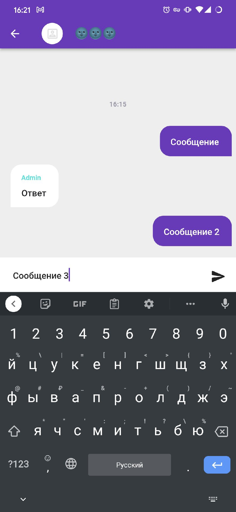
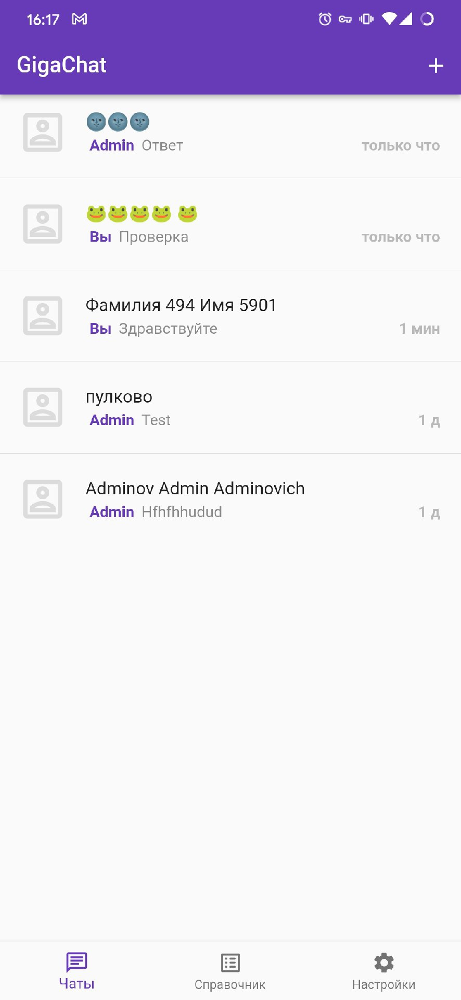
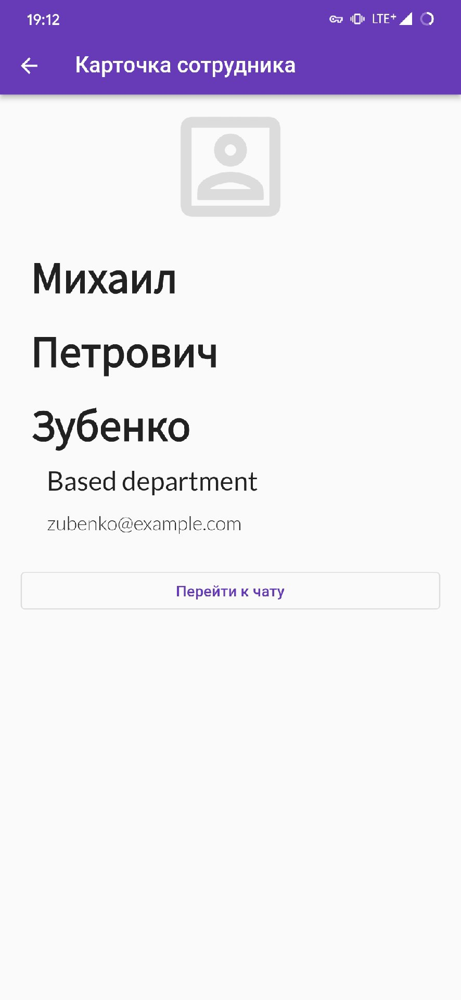

CorpMessengerBackend
=======
Дипломный проект, выполнен (и продолжает улучшаться) полностью самостоятельно.

Серверная часть мобильного приложения для коммуникации сотрудников предприятия (**Корпоративный чат**).
Представлена в виде Rest-API (*в планах перевести часть функционала на SignalR*).
Поддерживает чтение и отправку сообщений, создание конференций, справочник сотрудников (пока без поиска, но с навигацией).

Для авторизации ~~изобретён свой велосипед~~ используется собственный механизм с токенами и хэшированием паролей.

Есть админ-панель на Razor Pages, позволяет создавать/редактировать пользователей, отделы и т.п. Пока не придумал туда нормальную авторизацию, возможно вообще лучше перевести весь проект на майкрософтовскую встроенную аутентификацию/авторизацию.

Стэк: .NET 5/6, ASP.NET, Entity Framework, MS SQL Server, MsTest, Moq.

## Мобильное приложение

**Когда-нибудь здесь будет ссылка**

Стэк: Dart/Flutter, SQLite, куча библиотек по мелочи.

Билдится и отлично работает на Android и Windows. На Android потребление ОЗУ - 20мб.

